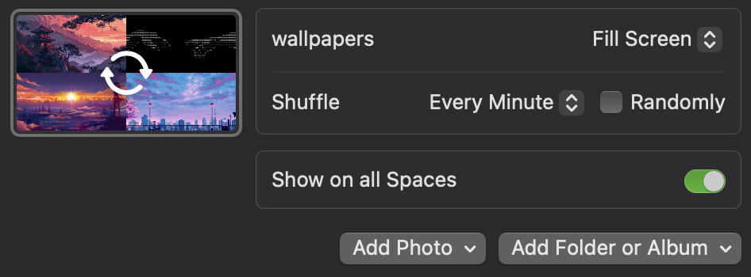

# MacOS Dotfiles

## Requirements
- This repo should be cloned into path ~/Development

## Apps installed:
- Ghostty (terminal)
- SKHD (keyboard shortcuts)
- Yabai (window manager)
- Better Touch Tool (I need the 4 finger touch)

## Apps installed but irrelevant:
- Notion
- Notion Calendar
- VS Code
- Arc Browser

## Settings
- just set the wallpapers to the folder:

- It should have more sometime

## Reminders
- Install https://github.com/mirairoad/macos_show_active_workspace (change the backgroundColor to NSColor.black)
  